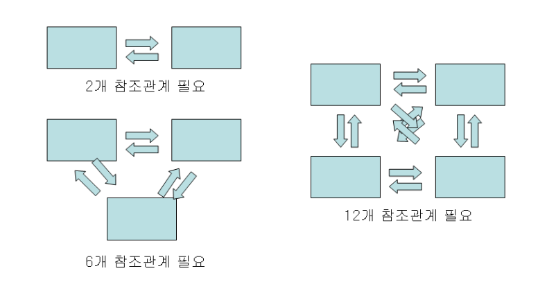

# 중재자 패턴 (Mediator pattern)
### 작성자
 임수빈
## 중재자 패턴(Mediator pattern)이란? 
모든 클래스간의 복잡한 로직(상호작용)을 캡슐화하여 하나의 클래스에 위임하여 처리하는 패턴

한 집합에 속해있는 객체들의 상호작용을 캡슐화하는 객체를 정의하는 패턴. 

프로그램의 실행 행위를 변경할 수 있기 때문에 행위 패턴으로 간주됨.

**객체들이 직접 서로를 참조하지 않도록 함**으로써 객체들사이의 소결합(loose coupling)을 촉진시키며, 개발자가 객체들의 상호작용을 독립적으로 다양화시킬 수 있게함.

 __*loosely coupled(느슨한 결합)__
 : 두 객체가 느슨하게 결합되어 있다는 것은 그 둘이 상호작용을 하긴 하지만, 서로에 대해 서로 잘 모른다는 것
   __객체 사이의 상호 의존성을 최소화__
    변경 사항이 생겨도 무난히 처리할 수 있는 유연한 객체지향 시스템을 구축할 수 있다.
  
 
  : 어떤 모듈을 변경할때, 다른 모듈의 변경이 요구된다면 결합 존재
두개의 모듈이 비슷한일을 할 때 (코드중복) 결합 존재
어떤 모듈이 다른 모듈의 코드를 사용할 때 발생
__* 완전히 제거 할수는 없다__
 
## 문제 - 언제 패턴을 사용하는가?
프로그램을 작성하다보면, 상호작용을 해야하는 경우,
객체들 간의 결합도가 증가하고 유연성이 떨어짐.


서로 명령을 주고 받을 수 있는 형식이 있다고 했을 떄,
서로 명령을 주고 받는 부분을 중재하는 형식을 정의하게됨. 
원래 서로 명령을 주고 받았던 개체들은 중재자 개체를 알게 하고, 중재자 개체는 이들 개체를 알게함.
특정 개체가 명령을 내릴 필요가 있으면 중재자 개체에게 전달하기만 하면 됨. 중재자는 해당 명령을 자신이 알고 있는 개체들 중에 적절한 개체에게 전달만 하면 됨.
이처럼 중재자 패턴을 사용하면 복잡한 상호작용을 하기 위한 복잡한 관계를 단순화시킬 수 있게 됨.

## 해결방안 - 설계를 구성하는 요소간의 관계 (클래스다이어그램)

## 결과 - 적용해서 얻는 결과
 
### - 장점

**서브클래스를 제한함.**
: 중재자는 다른 객체 사이에 분산된 객체의 행동들을 하나의 객체로 제한함.
행동을 변경하고자 한다면, Mediator클래스를 상속하는
서브클래스만 만들면 됨.

**Colleague객체 사이의 종속성을 줄입니다.**
 : 중재자는 행동에 참여하는 객체간의 Loose Coupling을 증진시킴. Mediator 클래스와 Colleague 클래스 각각을 독립적으로 다양화시킬 수 있고 재사용할 수 있음.
 
**객체 프로토콜을 단순화함**
: M:N의 관계에서 M:1의 관계로 복잡도를 떨어뜨려 유지 보수 및 재사용의 확장성에 유리하다.
복잡한 상호작용을 하기 위한 복잡한 관계를 단순화 시킬 수 있다.

**객체간의 협력 방법을 추상화함**
: 객체 사이의 중재를 독립적인 개념으로 만들고 이것을 캡슐화함으로써, 사용자는 각 객체의 행동과 상관없이 객체간 연결 방법에만 집중할 수있다.


### - 단점 
 **통제가 집중화됨**
:  상호작용의 복잡한 모든 것들이 자신 내부에서만 오가게함. 중재자 객체는 동료 객체간의 상호작용에 관련된 프로토콜을 모두 캡슐화하기 때문에, 훨씬 복잡해질 수 있음. Mediator클래스 자체의 유지보수가 어려워지게 될때도 있음.
 
 ### *구현시 고려해야 할 이슈
 1. Mediator 생략
    : 만약 관련 객체들이 오직 하나의 Mediator클래스와 동작한다면 Mediator를 추상화할 필요가 없음.
    추상클래스의 목적은 또 다른 상호작용을 정의할 새로운 Medator 서브클래스를 만들 때 필요
   
   2. Colleague-Mediator간의 의사소통
      : 필요한 이벤트가 발생할 때 Colleague클래스는 Mediator 클래스와 자료를 주고 받아야 함. 중재자 클래스를 구현하는 한가지 방법은 Observer 패턴을 사용하는 방법임
## 코드 예제
### 예제1 - 예제1은 이해를 돕기 위한 간단한 예제임
```java
//예제-1
//여러 사용자가 대화방에 메시지를 보낼때 모든 사용자에게 메시지를 표시하는 것은 대화방의 책임임.
public class MediatorPatterDemo 
{
	 public static void main(String[] args) 
	 {
	      User robert = new User("Robert");
	      User john = new User("John");

	      robert.sendMessage("Hi! John!");
	      john.sendMessage("Hello! Robert!");
	 }
}

```
```java
import java.util.Date;

//예제-1
//Mediator
public class ChatRoom 
{
	public static void showMessage(User user, String message)
	{
	      System.out.println(new Date().toString() + " [" + user.getName() + "] : " + message);
	}
}
```
```java
//예제-1
//Colleague
public class User 
{
	private String name;

	public String getName()
	{
		return name;
	}

	public void setName(String name) 
	{
		this.name = name;
	}

	public User(String name)
	{
	    this.name  = name;
	}

	public void sendMessage(String message)
	{
	    ChatRoom.showMessage(this,message);
	}
}
```
### 예제2 - Mediator패턴 예제
```java
//예제2
public class SocialMediaGroupTest 
{
	public static void main(String[] args) 
	{
		SocialMediaGroup mediator = new LearnAndShareGroup();
		/*
		 * Creating a Subscribers 
		 */
		Subscriber subscriber1 = new SubscriberImpl(mediator, "John");
		Subscriber subscriber2 = new SubscriberImpl(mediator, "Smith");
		Subscriber subscriber3 = new SubscriberImpl(mediator, "Greg");
		Subscriber subscriber4 = new SubscriberImpl(mediator, "Devin");
		
		mediator.addSubscriber(subscriber1);
		mediator.addSubscriber(subscriber2);
		mediator.addSubscriber(subscriber3);
		mediator.addSubscriber(subscriber4);
		
		subscriber1.send("Learn Design Patterns.");
	}
}
```
```java
//예제2
// Mediator 
public interface SocialMediaGroup 
{
	public void sendMessage(String msg, Subscriber user);
	
	void addSubscriber(Subscriber user);
}
```
```java
//예제2
//ConcreteMediator
public class LearnAndShareGroup implements SocialMediaGroup
{
	private List<Subscriber> subscribers;
	 
	public LearnAndShareGroup()
	{
		this.subscribers = new ArrayList<>();
	}
 
	@Override
	public void addSubscriber(Subscriber subscriber)
	{
		this.subscribers.add(subscriber);
	}
	
	@Override
	public void sendMessage(String msg, Subscriber senderSubscriber) 
	{
		for(Subscriber subscriber : this.subscribers)
		{		
			if(subscriber != senderSubscriber)
			{
				subscriber.receive(msg);
			}
		}
	}
}
```
```java
//예제2
// Colleague
public abstract class Subscriber 
{
	protected SocialMediaGroup mediator;
	protected String name;
	
	public Subscriber(SocialMediaGroup med, String name)
	{
		this.mediator=med;
		this.name=name;
	}
	
	public abstract void send(String msg);
	public abstract void receive(String msg);
}
```
```java
//예제2
public class SubscriberImpl extends Subscriber
{
	public SubscriberImpl(SocialMediaGroup med, String name) 
	{
		super(med, name);
	}

	@Override
	public void send(String msg) 
	{
		System.out.println(this.name+": Shared New Article on : "+msg);
		mediator.sendMessage(msg, this);
	}
 
	@Override
	public void receive(String msg) 
	{
		System.out.println(this.name+": There is new Article Available on : "+msg);
	}
}
```

__**관련 패턴__
### Facade
: 객체들로 구성된 서브시스템을 추상화해 좀 더 편한 인터페이스를 제공하려는 것으로, façade 객체는 서브시스템을 구성하는 객체로만 메시지가 전달되고, 서브시스템 구성객체가 façade 객체에 메시지를 전달하지는 못한다
    * Mediator는 양방향
    
### Observer 
: Mediator 패턴을 구현하는 한가지 방법은 Observer패턴을 사용하는 방법이다. Colleague 객체의 상태 변화가 일어날때마다 중재자에게 통보하면, 중재자는 처리방법에 따라 다른객체들에게 변경을 통보하여 처리한다.  

### 참고문헌 

[https://newsdu.tistory.com/entry/GoF%EB%94%94%ED%8C%A8-17-%EC%A4%91%EC%9E%AC%EC%9E%90Mediator-%ED%8C%A8%ED%84%B4](https://newsdu.tistory.com/entry/GoF%EB%94%94%ED%8C%A8-17-%EC%A4%91%EC%9E%AC%EC%9E%90Mediator-%ED%8C%A8%ED%84%B4)