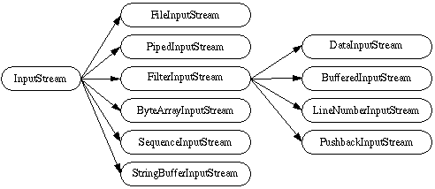
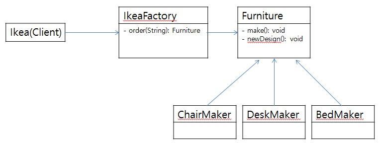

# 팩토리 메소드 패턴 (Factory Method pattern)
### 작성자
* 추연훈
> https://scorpio-mercury.tistory.com/18

## 팩토리 메소드 패턴(Factory Method pattern)이란?
* 팩토리 메서드 패턴(Factory method pattern)은 객체를 생성하는 공장을 만드는 것으로서
어떤 객체를 만드는 지는 자식클래스에서 결정하게 하는 디자인 패턴이다.


<br/>


> 그렇다면 이 팩토리 메서드 패턴을 왜 사용해야 할까?


<br/>

* 한마디로 말하자면 객체 간의 결합도를 낮추고 유지보수를 용이하게 하기 위해서이다.
객체만 생성하는 공장을 통해서 간접적으로 객체를 생성하게 하며 인터페이스를 정의하되, 실제 구현내용은 자식클래스에서 구현된다.
세부 구현 코드를 몰라도 부모클래스에서 자유롭게 사용이 가능하여 객체 간의 결합도가 낮아지는 효과를 볼 수 있다.

<br/>

* 객체 간의 결합도가 낮춰진다는 말은 한 클래스에 변화가 생겼을 때 다른 클래스에 영향이 끼치는 정도가 낮아진다는 말이고 유지보수를 할 때 최소의 클래스만 수정이 가능하게 되어 유지보수가 용이하게 되는 결과를 낳는다.

## 문제 - 언제 패턴을 사용하는가?
- 어떤 클래스가 자신이 생성해야 하는 객체의 클래스를 예측할 수 없을 때
- 생성할 객체를 기술하는 책임을 자신의 서브클래스가 지정했으면 할 때
- 객체 생성의 책임을 몇 개의 보조 서브클래스 가운데 하나에게 위임하고, 어떤 서브클래스가 위임자인지에 대한 정보를 국소화시키고 싶을 때


## 해결방안 - 설계를 구성하는 요소간의 관계 (클래스다이어그램)


* Creator: Product에서 객체를 받아오는 팩토리 역할을 한다.
* Creator1: 실질적인 행위를 하는 객체
* Product: 객체들을 하나로 통합하는 인터페이스
* Product1: Creator1이 생성한 인스턴스


## 결과 - 적용해서 얻는 결과


### - 장점
- 객체를 한 곳에서 관리할 수 있다.
- 유연하고 확장성 있는 구조를 만든다.
- 상황에 따라 서로 다른 객체를 반환할 수 있다.
### - 단점
- 불필요하게 많은 클래스를 정의할 수 있다.
- 구조가 복잡해질 수 있다.



## 코드 예제
IkeaFactory에서 Furniture를 생산하여 이케아에게 넘기는 구조를 만들어보았다.



우선, Furniture 인터페이스 하위에 DeskMaker, ChairMaker, BedMaker 하위 클래스가 존재한다.

```java
public interface Furniture {

	public void make();

	public void newDesign();

}

public class DeskMaker implements Furniture{

	public DeskMaker() {
		System.out.println("책상메이커 삼삼대기");
	}

	@Override
	public void make() {
		System.out.println("책상을 만들었습니다.");
	}

	@Override
	public void newDesign() {
		System.out.println("새로운 책상 디자인을 연구합니다.");

	}
}

public class ChairMaker implements Furniture{

	public ChairMaker() {
		System.out.println("의자메이커 삼삼대기");
	}

	@Override
	public void make() {
		System.out.println("의자를 만들었습니다.");
	}

	@Override
	public void newDesign() {
		System.out.println("새로운 의자 디자인을 연구합니다.");

	}
}

	public BedMaker() {
		System.out.println("침대메이커 삼삼대기");
	}

	@Override
	public void make() {
		System.out.println("침대를 만들었습니다.");
	}

	@Override
	public void newDesign() {
		System.out.println("새로운 침대 디자인을 연구합니다.");

	}
}
```

클라이언트, 즉 Ikea는 각 가구를 생성하기 위해 IkeaFactory를 통해 객체를 불러들인다. IkeaFactory는 입력받은 값으로 불러올 객체를 구분한다.

```java
public class Ikea {

	public static void main(String[] args) {

		IkeaFactory ikeaFactory = new IkeaFactory();

		System.out.println("주문 1: 책상 생성");
		ikeaFactory.order("책상").make();

		System.out.println("주문 2: 의자 생성");
		ikeaFactory.order("의자").make();

		System.out.println("주문 3: 침대 디자인 연구");
		ikeaFactory.order("침대").newDesign();

	}

}

public class IkeaFactory {

	public Furniture order(String type){

		if (type == "침대") {return new BedMaker();}
		if (type == "의자") {return new ChairMaker();}
		if (type == "책상") {return new DeskMaker();}

		return null;

	}

}
```
Ikea는 IkeaFactory에서 파라미터를 전달하여 자유롭게 다른 객체를 받을 수 있게 되었다. 결과창은 다음과 같다.


### 참고문헌
* http://egloos.zum.com/ani2life/v/2887675
* https://m.blog.naver.com/itperson/220885347418
* https://xxxelppa.tistory.com/36
* http://egloos.zum.com/sakula99/v/2976589
* GoF의 디자인 패턴
