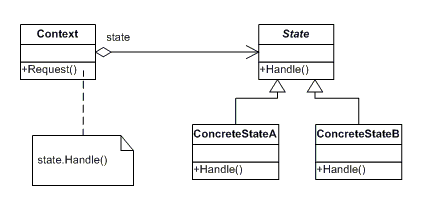

# 스테이트 패턴 (State pattern)

### 작성자 : 남기웅

## 스테이트 패턴(State pattern)이란?

행위 패턴 중 하나로 객체의 내부 상태에 따라 스스로 행동을 변경할 수 있게 허가하는 패턴. 

예를 들어 , Git을 이용한다 할때 새 파일을 만들기 , 스테이지에 올리기(git add) , 로컬 저장소에 커밋하기, 원격 저장소에 푸쉬하기와 같은 기능을 할 수 있고 이를 잘보면 스테이지에 올리려면 먼저  새로운 파일이 존재해야 하고 로컬저장소에 커밋하려면 스테이지에 올라가 있어야 됩니다.

즉 , 현재 상태에 따라서 행위가 달라지게 되는데 , 이를 분기문으로 처리하면 상태가 많아지면 많아질수록 코드가 복잡해지며 이 분기문이 다른 연산에도 쓰인다면 유지보수가 힘들다는 점이 있습니다.

이러한 문제를 해결하기 위한 패턴이 바로 스테이트 패턴입니다.

## 문제 - 언제 패턴을 사용하는가?

먼저 문제코드 부터 보겠습니다.

- 문제코드

  ```java
  public class Git {
  	//패턴 적용 전
  	
  	private static String NEW_STATUS = "NEW_STATUS";
  	private static String ADD = "ADD";
  	private static String COMMIT = "COMMIT";
  	private static String PUSH = "PUSH";
  	private static String state;
  	
  	public Git() {
  		state=NEW_STATUS;
  	}
  	public void Do() {
  		//NEW_FILE 상태일때는 ADD상태로 
  		if("NEW_STATUS".equals(state)) {
  			System.out.println("CurrentState : "+state);
  			System.out.println("Git Add File");
  			state=ADD;
  		}
  		//ADD 상태일때는 COMMIT상태로
  		else if("ADD".equals(state)) {
  			System.out.println("CurrentState : "+state);
  			System.out.println("Git Commit");
  			state=COMMIT;
  		}
  		//COMMIT 상태일때는 PUSH상태로
  		else if("COMMIT".equals(state)) {
  			System.out.println("CurrentState : "+state);
  			System.out.println("Git Push");
  			state=PUSH;
  		}
  		//PUSH상태일때는 NEW_FILE상태로
  		else {
  			System.out.println("CurrentState : "+state);
  			System.out.println("Create NEW FILE");
  			state=NEW_STATUS;
  		}
  			
  	}
  }
  ```

  위코드는 패턴 소개시 잠깐 설명했던 git의 4가지 상태 (NEW_STATUS,ADD,COMMIT,PUSH)가 존재하고 각 상태마다 하는 일이 다른것을 표현하고 있습니다.

  여기서 만약에 PULL , BRANCH등 다른 기능이 추가되면 분기문이 복잡해질 것이고 이 분기문이 다른 메소드의 내용에도 추가된다면 유지 보수가 더 복잡할 것입니다. 

  실행 결과는 다음과 같습니다.

- 실행결과

  ```java
  public class Client {
  
  	public static void main(String[] args) {
  		// 패턴 적용 전
  		Git gitbash = new Git();
  		gitbash.Do();
  		gitbash.Do();
  		gitbash.Do();
  		gitbash.Do();
      }
  }
  ```

  ```java
  CurrentState : NEW_STATUS
  Git Add File
  CurrentState : ADD
  Git Commit
  CurrentState : COMMIT
  Git Push
  CurrentState : PUSH
  Create NEW FILE
  ```

상태의 경우가 늘어남에 따라서 분기문의 내용도 증가하고 이는 가독성을 떨어 뜨립니다. 또한 상태의

추가 및 삭제도 불편하게 만듭니다. 이를 해결하기 위해 <b>스테이트 패턴</b>을 적용해 보겠습니다.

## 해결방안 - 설계를 구성하는 요소간의 관계 (클래스다이어그램)

스테이트 패턴은 문제를 해결하기 위해 <b>각 상태를 인스턴스화</b> 시켜서 상태의 확장 및 삭제를 자유롭게

해줍니다. 


- 클래스 다이어그램




- 해결코드 (4가지 각 상태를 객체화 시킴)

  ```java
  //State Interface
  public interface Git {
  	public Git Do();
  }
  ```

  ```java
  //ConcreteState 1 , NewStatus
  public class NewStatus implements Git{
  
  	@Override
  	public Git Do() {
  		System.out.println("CurrentState : NewStatus");
  		System.out.println("Git Add File");
  		return new Add();
  	}
  
  }
  ```

  ```java
  //ConcreteState 2 , Add
  public class Add implements Git{
  
  	@Override
  	public Git Do() {
  		System.out.println("CurrentState : ADD");
  		System.out.println("Git Commit");
  		return new Commit();
  	}
  }
  ```

  ```java
  //ConcreteState 3 , Commit
  public class Commit implements Git{
  	
      @Override
  	public Git Do() {
  		System.out.println("CurrentState : COMMIT");
  		System.out.println("Git Push");
  		return new Push();
  	}
  }
  ```

  ```java
  //ConcreteState 4 , Push
  public class Push implements Git{
  	
  	public Git Do() {
  	System.out.println("CurrentState : PUSH");
  	System.out.println("NEW FILE");
  	return new NewStatus();
  	}
  }
  ```

문제코드에서 정의했던 4가지 상태들을 인스턴스화 시켰습니다. Git 인터페이스에서는 각 상태에서 git명령어를 쓰면  어떤 행위를 하므로 공통메소드인 Do() 메소드를 공통으로 정의해 두었습니다.      나머지 클래스들은 Git 인터페이스를 구현한 상태 클래스들입니다.

- 실행결과

```java
//패턴 적용 후
public static void main(String[] args) {
		Git gitbash = new NewStatus();
		gitbash=gitbash.Do();
		gitbash=gitbash.Do();
		gitbash=gitbash.Do();
		gitbash=gitbash.Do();
   }
```

```java
CurrentState : NewStatus
Git Add File
CurrentState : ADD
Git Commit
CurrentState : COMMIT
Git Push
CurrentState : PUSH
NEW FILE

```

결과는 문제코드랑 같지만 상태를 추가하거나 삭제할때 클래스를 새로 작성하거나 삭제해 줌으로써 보다 쉽게 상태를 조작할 수 있습니다.


## 결과 - 적용해서 얻는 결과

- <b>장점</b> : 기존의 분기문을 이용하여 각 상태에 따른 행위를 결정하는 방법보다  손쉽게 상태를 추가,삭제 할 수 있다.

- <b>단점</b> : 각 상태에 맞는 어떤 행위를 할때 다른상태로 전이되기 때문에 각 상태객체간 종속성이           존재한다.

   

### 참고문헌

GoF의 디자인 패턴 